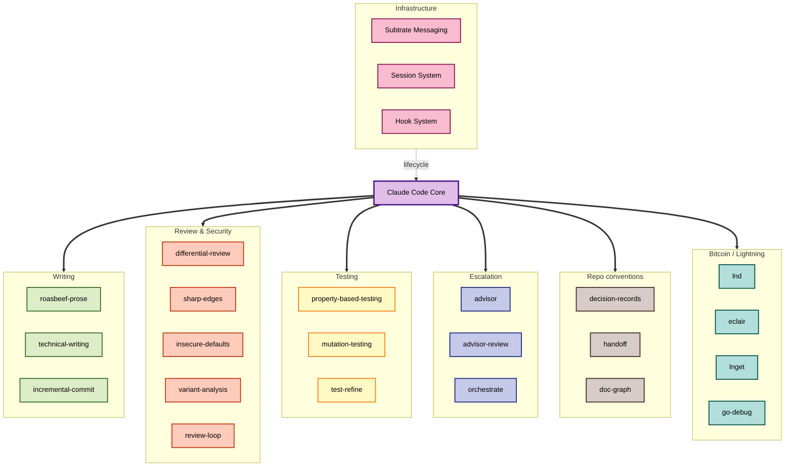

# beefstack

A Claude Code configuration built up over a year of daily use, mostly on Bitcoin
and Lightning Network work. Skills, sub-agents, hooks, session continuity,
inter-agent messaging, and a set of repository conventions, arranged so that
long and unglamorous engineering tasks survive context compaction and can be
handed to a fleet rather than done one prompt at a time.

It is a working setup rather than a demo. Everything here earned its place by
being used, and the usage numbers below are measured from the local transcripts
rather than estimated.

## How it actually gets used

Measured across 8,743 session transcripts spanning 279 projects, from 2025-09-28
to 2026-09-01. That is 31,891 prompts over 338 days, or roughly 94 a day.

Skills are invoked 1,355 times. The distribution is lopsided in a way worth
noting: a handful of skills carry most of the load, and they are the ones that
handle the parts of the job nobody enjoys.

| Skill | Invocations | What it carries |
|-------|------------:|-----------------|
| `substrate` | 326 | Agent mail, status, review requests |
| `roasbeef-prose` | 237 | Voice for commits, PRs, docs |
| `incremental-commit` | 188 | Splitting a diff into atomic commits |
| `differential-review` | 58 | Security-focused review of a change |
| `sharp-edges` | 49 | Footgun and misuse-resistance audit |
| `insecure-defaults` | 47 | Fail-open configuration hunting |
| `resolve-pr-comments` | 47 | Working through review feedback |
| `session-*` | 63 | Init, resume, and logging across compaction |
| `agent-browser` | 37 | Driving a real browser |
| `technical-writing` | 34 | Clarity pass, distinct from voice |
| `hunk` | 25 | Line-level staging and non-interactive rebase |
| `advisor` + `advisor-review` | 34 | Escalating a judgment call to a stronger model |

Sub-agents run far more often than skills do, because most real work fans out:

| Agent | Spawns |
|-------|-------:|
| `general-purpose` | 1,175 |
| `Explore` | 592 |
| `code-reviewer` | 202 |
| `security-auditor` | 168 |
| `function-analyzer` | 118 |
| `spec-compliance-checker` | 49 |
| `Plan` | 42 |

Two things stand out. The writing skills are near the top, which is not what you
would guess from a list of engineering tools, but a commit message or a PR
description is written on nearly every task. And review runs adversarially by
default: `code-reviewer`, `security-auditor`, `differential-review`,
`sharp-edges`, and `insecure-defaults` together account for more invocations
than any single feature-building workflow.

## The operating model

The skills are the visible part. What makes them compose is a short set of
rules in [`CLAUDE.md`](CLAUDE.md) that every session loads. They are worth
stating here because they explain why the rest of the stack is shaped the way
it is.

**Manage complexity first.** Faced with a bad state, ask whether the design can
make it unrepresentable before adding logic that copes with it. A fix that adds
branches, flags, retries, or special cases for a rare path is treated as a
design smell, and a review that manufactures rare scenarios and lands a pile of
machinery to cover them is the named anti-pattern. Prefer the smaller diff.

**Decide who to ask before deciding what to do.** A judgment call goes to
`/advisor` when the main loop is on a cheap model; on a top-tier model the
session reasons it through itself. A preference or scope call only the user can
settle stops the work and asks with concrete options. A non-blocking status
question goes out as Subtrate mail. The three channels are not conflated.

**Work survives compaction.** Context is compacted automatically as it fills,
and the first action after compaction is `/session-resume`. Sessions log as
they go and checkpoint at milestones, so a task resumes instead of restarting.

**A task is complete only when it works end to end.** Tests pass, every
acceptance criterion is met, and a Stop hook that blocks is by design: finish
the work or say what remains. Nothing is marked done to get past a hook.

**Corrections become rules.** When the user corrects a behavior that could
recur, `/codify` turns the incident into a hook, a `CLAUDE.md` rule, or a
change to the skill that was running, whichever removes the failure mode most
directly. The point is to keep `CLAUDE.md` from bloating: tightening an
existing rule beats adding one.

**Finished work gets one adversarial pass.** Before a substantive change is
called done, `/advisor-review` has a fresh top-tier reader verify the
load-bearing invariants, look for simplifications, and hunt for live variants
of the bug shapes just fixed. One pass is the rule; a second over a clean diff
is diminishing returns.

## Architecture



## Skills

Grouped by what they are for. Most are model-invoked when the task matches; a
few are deliberately opt-in only.

### Writing

| Skill | Description |
|-------|-------------|
| `roasbeef-prose` | The voice: cadence, idioms, "In this commit, we...". Wins over clarity rules on any conflict |
| `technical-writing` | The clarity layer, from Pinker plus Google's style guide. Counters against dense prose, invented metaphors, and writing that performs |
| `incremental-commit` | Carve a diff into atomic commits, each with a message that explains why |
| `slide-creator` | Written content into slide images |
| `explainer-video` | Script to voiceover to rendered mp4 |

### Review and security

The first three come from the [Trail of Bits plugin](https://github.com/trailofbits/claude-plugins)
rather than from `skills/`, and together they are the most-used review path here.

| Skill | Description |
|-------|-------------|
| `differential-review` | Security-focused review of a diff, with blast radius and regression checks |
| `sharp-edges` | Footgun APIs, dangerous configuration, misuse-resistance |
| `insecure-defaults` | Fail-open defaults and hardcoded secrets |
| `variant-analysis` | Find more instances of a bug you just found |
| `review-loop` | Adversarial review, triage, and fix until a cold verifier signs off |
| `agentic-code-reasoner` | Execution-free deep analysis with a reasoning certificate |

### Testing

| Skill | Description |
|-------|-------------|
| `property-based-testing` | Invariant-driven tests, `rapid` for Go |
| `mutation-testing` | Validate test strength by mutating the code under test |
| `test-refine` | Cut trivial tests, strengthen weak assertions, close branch gaps |
| `agent-ci` | Run GitHub Actions locally before pushing |
| `ci-loop` | Watch a CI run to completion, classify failures, remediate |

### Escalation and orchestration

| Skill | Description |
|-------|-------------|
| `advisor` | Consult a stronger model on a judgment call from a cheaper session |
| `advisor-review` | Final adversarial audit of finished work |
| `orchestrate` | Expensive planner decomposes, cheap workers execute in parallel, planner synthesizes |

### Repo conventions

How a repository records decisions and keeps its documentation true. These
were distilled from the [Loom](https://github.com/Roasbeef/loom) repository,
where they run daily, and each has an `init` mode that installs the arrangement
in a repo that has none. The section below says what they set up.

| Skill | Description |
|-------|-------------|
| `decision-records` | Where a decision goes: ADRs amended by addendum, protocol-change proposals for frozen interfaces, design notes with a status lifecycle, review waves with triage, corrections on the issue |
| `handoff` | Rewrite `docs/next.md` from a fresh audit at the end of a body of work; `init` creates it plus a starter `docs/execution.md` |
| `doc-graph` | Per-package `CLAUDE.md`/`AGENTS.md` graph with a no-toolchain gate (coverage, mirror, staleness, citation drift) and a repo-customized doc-gardening skill |

### Bitcoin and Lightning

| Skill | Description |
|-------|-------------|
| `lnd` | Lightning Network Daemon in Docker, RPC, channels, regtest |
| `eclair` | ACINQ's Eclair in Docker, API, payment channels |
| `lnget` | Fetch L402-protected URLs that require Lightning payments |
| `go-debug` | Interactive Delve debugging driven through tmux |

### Tooling

| Skill | Description |
|-------|-------------|
| `substrate` | Agent mail, identity, review requests |
| `hunk` | Line-level staging and non-interactive rebase |
| `agent-browser` | Browser and Electron automation |
| `agent-cli` | Design and review CLIs meant for agents to consume |
| `frontend-design` | Distinctive production-grade UI |
| `shadcn` | shadcn/ui components and registries |
| `nano-banana` | Image generation and editing via Gemini |
| `litbucket` | Publish static artifacts to an internal address |
| `herdr` | Terminal multiplexer control for coding agents |
| `skill-creator` | Meta-skill for writing new skills |
| `codify` | Turn an agent misbehavior or a correction into a hook, CLAUDE.md rule, or skill |

## How a repository is run

The three convention skills encode one way of working, and it is easier to
explain as a whole than skill by skill.

**A decision is only settled once it is written where the next reader will look
for it.** There are five homes and they are not interchangeable. An
architecture decision record holds a ruling whose consequences outlive one
change, and it is amended by an addendum inside the file, never by a silent
edit. A frozen interface moves only through a numbered protocol-change
proposal, written before the work that needs it. A design note carries an
exploration or a pre-code ruling, with a status line that moves from "note, not
a work package" through "ruling, pre-code" to "built" rather than the note
being deleted when its work lands. A review wave files one report per reviewer
and one triage roll-up with a FIX, DOC, DEFER, or DISMISS disposition per
finding; the reports are records of what was seen at a commit and are never
re-pinned to a later tree. And when measurement contradicts an issue's
diagnosis, which happens often, the correction goes on the issue as a comment
before it goes in a commit. Across all five: a rule a gate can check belongs in
a lint or a test, not in prose, because prose drifts and a gate does not.

**The handoff is rewritten, not appended to.** `docs/next.md` is the file a
fresh session reads first: where the tree stands against the plan of record,
what to do next with exit criteria and a cut list, the rulings already made so
nobody re-litigates them, what is deliberately left open, and how to verify a
change. It is re-baselined at the end of every body of work by auditing the
previous edition claim by claim against the tree and a CI run, and the claims
that turned out false are named as such rather than dropped. Its sibling
`docs/execution.md` is how work gets done: one orchestrator and disjoint
sub-agent slices, long briefs that give the ruling rather than the question,
verification by the gate's own exit code on a clean checkout, mutation testing
as the standard of proof, and a hazards section where every entry cost real
time first.

**Every package documents itself, and a gate keeps it honest.** Each package
with source carries a `CLAUDE.md` denser than the root one: purpose, key types,
real dependency edges, its traffic with concrete type names, and the invariants
that break things when violated. `AGENTS.md` beside it is a byte-identical
mirror so every agent reads the same file. A shell script with no toolchain
dependency checks coverage, mirror equality, staleness by git commit time
rather than mtime, and every `file.ext:NN` citation in the docs: the file must
resolve to exactly one path, the line must exist, and the backticked symbol
named beside it must still be within a few lines of it. Staleness is a warning
by design, and the warning list is the queue the doc-gardening skill works
from, reading source and changing only what moved.

## Sub-agents

Specialized agents that run in their own context window, so a deep investigation
does not consume the main loop's budget.

| Agent | Purpose |
|-------|---------|
| Architecture Archaeologist | Codebase analysis with Mermaid diagrams |
| Code Scout | Fast targeted analysis, time-boxed |
| Code Reviewer | PR review tuned for Bitcoin and Lightning p2p code |
| Security Auditor | Vulnerability hunting with proof-of-concept development |
| Test Engineer | Test generation with property-based testing and fuzzing |
| Documentation Double-Checker | Verify docs against the actual code |
| Go Debugger | Delve and tmux |
| Debug Chronicler | Turn a debugging session into a runbook |
| Mutation Tester | Mutation analysis for test quality |
| Design Iterator | Screenshot, analyze, improve, repeat |
| Presentation Builder | Slide decks from written content, with feedback rounds |

## Slash commands

Commands in `commands/` are the user-invoked entry points that fan work out to
the agents above. The review family (`/code-review`, `/security-review`,
`/focused-review`, `/pre-pr-review`, `/batch-review`, `/resolve-pr-comments`)
is the most used. `/ideate` and `/goalcraft` are interview-driven planning;
`/issue-plan` turns a GitHub issue into an implementation plan; `/test-forge`
and `/fuzz-test` generate tests; `/chronicle-fix` turns a debugging session
into a runbook; and the `/session-*` family is the continuity system described
below.

## Subtrate and mission control

[Subtrate](https://github.com/roasbeef/subtrate) is the command center for
running more than one agent at a time. It solves the two problems that make
multi-agent work painful: agents cannot talk to each other, and they lose their
identity when context compacts.

This is the piece beefstack pairs with most closely, and `substrate` is the
single most-invoked skill here at 326 calls.

### Mission control mode

The web UI at `http://localhost:8080` is a zoomable canvas rather than a list.
Every running agent is a card you can pan and zoom around, Prezi style. From
there you can watch agents work in real time, read and answer their mail, drop a
screenshot or mockup straight onto a card so it arrives in that agent's inbox,
and see who is active, idle, or offline at a glance.

That matters once a task is fanned out across a fleet. Instead of tabbing
between terminals and losing track of which agent is blocked on what, the whole
run is one board. Agents that need a decision surface it as mail; you answer
from the canvas; they carry on. Reviews requested with `substrate review request`
land there too, so the review cycle happens on the same surface as the work.

### Core mechanics

- **Identity**: persistent codenames in the form `CodeName@project.branch`,
  auto-generated on first use and restored across compaction by the
  PreCompact and SessionStart hook pair.
- **Mail**: async threaded messaging with priorities, per-recipient state, and
  full-text search. `substrate send-diff` posts a branch diff with syntax
  highlighting; `--attach` embeds an image inline.
- **Liveness**: heartbeats on session start, prompt submit, and during stop
  polling, giving active, idle, and offline status.

Subtrate is the primary channel for reaching a human outside a blocking prompt.
Status updates go through `substrate send` rather than to a console nobody is
watching.

## Session management

Sessions preserve progress, decisions, and discoveries across context
compaction, so a long task resumes instead of restarting.

```
/session-init  ->  (active work)  ->  /session-close --complete
                       |
                 (compaction)
                       |
               /session-resume
```

- Per-project tracking in `.sessions/` directories
- Automatic state preservation via the PreCompact hook
- Structured logging: progress, decisions, discoveries, blockers
- Full documentation in [SESSIONS.md](SESSIONS.md)

## Hooks

Shell scripts bound to Claude Code lifecycle events. These are what make
identity and session continuity work without the model having to remember, and
what turns a rule into something the harness enforces rather than something the
model is asked to recall. What follows is what `settings.json` actually wires;
`hooks/` also holds a few older scripts (a sensitive-file guard, a Go format
check, a git status refresher, a test runner) that are no longer bound to any
event.

### Substrate hooks

- **SessionStart**: heartbeat, inject unread mail
- **UserPromptSubmit**: silent heartbeat, check for new mail
- **Stop**: long-poll, keeping the agent alive for inter-agent work
- **SubagentStop**: one-shot mail check, then exit
- **PreCompact**: save identity for restoration afterward
- **Notification**: forward the harness notification to the agent's card
- **PermissionRequest** on `ExitPlanMode`, and **PostToolUse** on plan
  writes and task-list changes: sync the plan and tasks to mission control

### Session hooks

- **SessionStart** (`load_project_context.sh`): show the active session's
  summary, progress, and blockers, and suggest `/session-resume`
- **SessionStart** after compaction: a one-line reminder that
  `/session-resume` runs before anything else
- **UserPromptSubmit** (`context_enhancer.py`, `session_context.py`): detect
  "continue" or "resume" and inject session context
- **PreCompact** (`save_important_context.sh`): checkpoint the session and
  emit the context that must survive the summary

### Prompt hooks

- **UserPromptSubmit** (`ultrathink_hook.py`): expand a prompt-level
  thinking directive before the model sees it

[`HOOKS.md`](HOOKS.md) has the recipes for writing new ones.

## Directory structure

```
~/.claude/
├── CLAUDE.md              # Global instructions for all projects
├── README.md              # This file
├── SESSIONS.md            # Session system documentation
├── HOOKS.md               # Hook system documentation
├── settings.json          # Hooks, permissions, sandbox, model
├── skills/                # Skills, one directory each with SKILL.md
├── agents/                # Sub-agent definitions
├── commands/              # Slash command definitions
├── hooks/                 # Lifecycle hook scripts
│   ├── substrate/         # Agent messaging
│   ├── sessionstart/
│   ├── precompact/
│   ├── userpromptsubmit/
│   └── ...                # older scripts, no longer wired
├── projects/              # Per-project state and transcripts
├── plans/                 # Plan files from planning sessions
└── plugins/               # Plugin cache
```

## Getting started

1. Clone to your home directory:
   ```bash
   cd ~ && git clone https://github.com/Roasbeef/beefstack.git .claude
   ```

2. Make hook scripts executable:
   ```bash
   chmod +x ~/.claude/hooks/**/*.sh ~/.claude/hooks/**/*.py
   ```

3. Install Subtrate hooks:
   ```bash
   substrate hooks install
   ```

4. Share the instructions and skills with other agents. `CLAUDE.md` doubles
   as the `AGENTS.md` that Codex and the rest read, so link rather than copy
   to keep them from drifting:
   ```bash
   mkdir -p ~/.agents
   ln -sfn ~/.claude/CLAUDE.md ~/.codex/AGENTS.md
   ln -sfn ~/.claude/CLAUDE.md ~/.agents/AGENTS.md
   ln -sfn ~/.claude/skills ~/.agents/skills
   ```

5. Review `settings.json` for hook paths, permissions, model, and sandbox
   configuration. Note that `permissions.defaultMode` is set to
   `bypassPermissions` here, which suits a sandboxed personal setup and may not
   suit yours.

6. To bring the repository conventions to a project of your own, run
   `/decision-records init`, `/handoff init`, and `/doc-graph init` in that
   repo. Each detects what already exists, asks the one or two questions it
   cannot answer from the tree, and installs the rest.

See the [Claude Code documentation](https://docs.anthropic.com/en/docs/claude-code/overview)
for general setup and the [hooks guide](https://docs.anthropic.com/en/docs/claude-code/hooks-guide)
for hook configuration.
